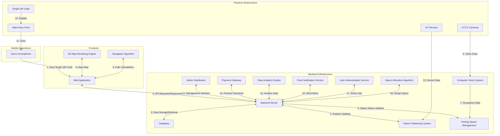

# Indoor-Parking-Assistance-System-using-Object-Detection
This repository contains the necessary content for an **Indoor Parking Assistance System** that uses **object detection** to identify empty parking spaces and provides **real-time navigation** to guide drivers to them. The system aims to improve parking efficiency and reduce the time spent searching for available spots in indoor environments.

